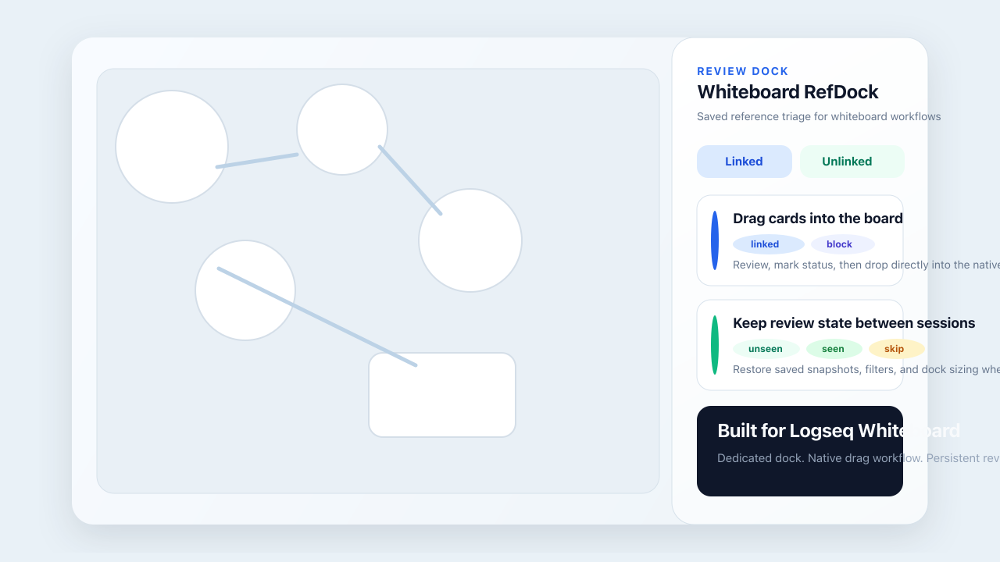

# Whiteboard RefDock

Review saved linked and unlinked reference snapshots in a dedicated dock while working on a Logseq whiteboard.



## What It Does

Whiteboard RefDock turns reference review into a whiteboard-first workflow.

Instead of relying on Logseq's live references view, it creates a saved snapshot for the current whiteboard and keeps that review queue visible in a dedicated right-side dock.

## Features

- Create a saved snapshot from a page or a keyword.
- Review `Linked` and `Unlinked` references in separate tabs.
- Mark items as `unseen`, `seen`, or `skipped`.
- Drag page and block items directly into the native Logseq whiteboard.
- Restore the saved snapshot, item state, and dock width when you return.
- Toggle the dock from the Logseq toolbar.

## Best For

- Large reference review sessions with hundreds of candidates.
- Whiteboard synthesis workflows where references need triage before being dragged into the canvas.
- Users who want a persistent review queue instead of Logseq's live reference panel.

## How To Use

1. Open a native Logseq whiteboard.
2. Toggle `Whiteboard RefDock` from the toolbar if the dock is hidden.
3. Choose `Page` or `Keyword`.
4. Click `Create Snapshot`.
5. Review items in the `Linked` and `Unlinked` tabs.
6. Drag useful items into the whiteboard.
7. Mark items as `seen`, `unseen`, or `skipped`.

## Platform Support

- Desktop Logseq: supported
- Web Logseq: not supported
- Database graph: not declared as supported

This plugin currently targets the desktop whiteboard workflow and relies on host-side dock behavior that is not available in the web sandbox.

## Why `effect: true`

This plugin uses `effect: true` because it needs same-origin host access for:

- a custom host-side whiteboard dock
- reliable dock visibility control across host and iframe surfaces
- drag-and-drop behavior that matches native whiteboard interactions

Without that access, the plugin cannot provide the current dock experience.

## Privacy

Whiteboard RefDock does not send graph data to external services.

All snapshots and item state are stored locally in the Logseq plugin state for the current graph.

## Development

```bash
npm install
npm run build
```

## Release

Tag a version and create a GitHub release.

The included `.github/workflows/publish.yml` workflow will build the plugin and attach a release zip that is suitable for Logseq Marketplace submission.

## Marketplace Submission Notes

Marketplace-specific files are included under [`./marketplace`](./marketplace):

- `manifest.json`
- `SUBMISSION.md`

These files are intended to be copied into the `logseq/marketplace` submission PR.
